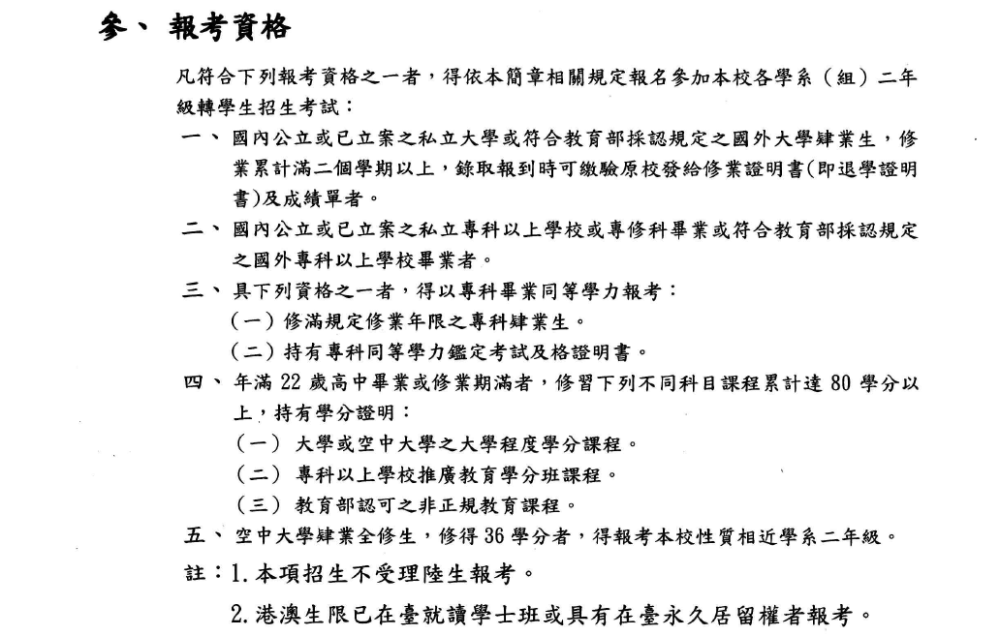

# 轉學考報名有什麼資格限制嗎？我是五專生，能夠報考轉學考嗎？

基本上**以簡章為主**，下圖即為 104 學年度國立臺灣大學學士班二年級轉學生招生簡章中之內容：

上述內容可能根據不同學校系所與招生年級而有不同，不過仍可以整理成下列形式：

1. 大學在校生
2. 大學畢業生
3. 大學肄業生（就是你被二一「退學」，但仍符合修業年數）
4. 專科畢業生
5. 專科肄業生（需修習學分數答依訂標準[^1]）

以上資格不得為「操行退學者」，與「學籍開除者」。最常見的問題是：我目前就讀Ａ校ㄅ系，我可以考轉學考進入Ａ校ㄆ系嗎？答案是可以的。

[^1]: 一般簡章上規定為 220 學分