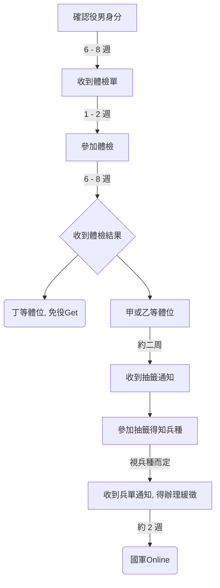

# 我是退學／休學的男生，有兵役問題會不會被徵召入伍？該怎麼處理？

基本上有兵役問題的同學其實就是被退學了，或者是你想休學讀書，或者你體檢過了等等。但如果真的不小心這樣或不得已選擇這條接近兵役的路，那該怎麼避免兵單？以下為報名與兵役相關時間流程圖：

上述流程圖來源為：[批踢踢實業坊 Transfer 看板： 大三生想轉學 (yseric)](https://www.ptt.cc/bbs/Transfer/M.1200505723.A.DBE.html)

除此之外， [批踢踢實業坊 | 二一板(You_out)](https://www.ptt.cc/bbs/You_out/index.html) 裡還有各式各樣的兵役文章，因為篇幅有限故僅稍微說明一下，首先你要先知道你是什麼時候被退學、休學、或暫時消除學籍？必須先知道是上學期還是下學期發生這件事，然後你是否已經體檢過了？

## 1. 基本上已經體檢過的同學，你接下來就是會抽兵役，然後登入。（不到幾個月的時間非常地快。）

但如果你尚未體檢，你下學期不能去學校讀：恭喜你，你可以安心的過完這新的上半年，持續讀書到七月報考指考或轉學考，都不會被抓去登入。因為一、二月份學校才會通知所屬的兵役處，然後過幾個星期後兵役處將會詢問你是否繼續就讀，然後再過幾個星期後會通知你去體檢，然後再過幾個星期後去抽兵役，然後再過幾個星期後你將會收到兵單。

## 2. 耶？我都收到兵單了我無法安心！
放心，因為從體檢到收到兵單，你已經過了無數個歲月了，你的轉學考／指考的准考證已經到你的手上了，你甚至可以無視兵單然後辦理緩徵唷。但如果你是尚未體檢，可是上學期就不能就讀了呢：我只能說這類的同學就要安分一點了，因為這是一個非常冒險的舉動，你的運氣要非常好，你所屬的兵役處要非常忙、非常多人搶著要登入，不然就會被抓去伏地挺身。

## 3. 結論
要休學、逃離學校的時間點請在，**下學期**。（尚未體檢的同學有的是籌碼唷！）