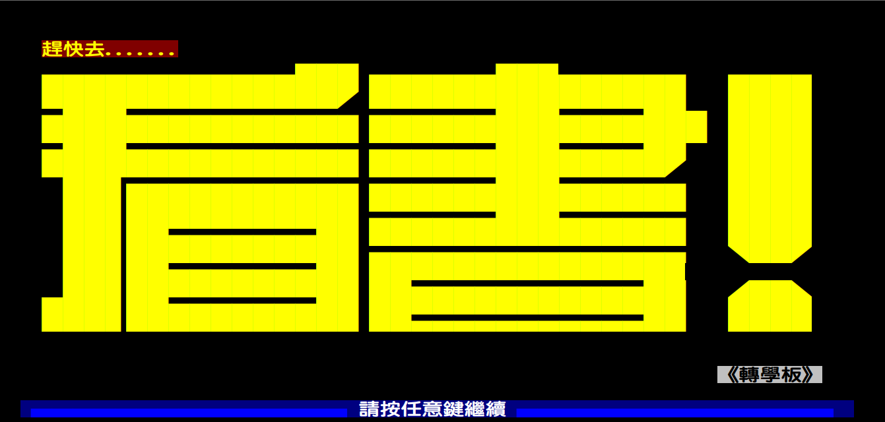

# 綜論如何準備轉學考?

## 1. 檢討自己、情報蒐集

- 檢討自己，為什麼要考？
- 自己的程度在哪？
- 目前的障礙與瓶頸？
- 評估可能遭遇的困難？
- 了解不同校系的狀況，各校系的授課差異與風評？
- 報考校系考古題的著重單元與難易度？
- 各個考試科目出題的方式？
- 歷年來的考試時間？
- 簡章是否購買？
- 學長姊的心得分享？
 
## 2. 建立自信、下定決心

明白各校系的上榜容易度後，衡量自身的狀況是否真的要踏上備考的路程？其中遭遇的困難與孤獨是否能夠忍受？不論他人如何看低與勸戒，**即使心得文中沒有先例，自己有無信心當那第一個範例？**
 
## 3. 鎖定目標、起策計畫

決定自己要報考的校系，總結身邊現有或可取得之資源（比如該採買的書籍、補習班的報名與否、系上教授是否能夠諮詢…等）依照所剩餘的天數歸納長程與短程計畫（長程如什麼時候完結第一次內容？什麼時候完成第一次和第二次複習？什麼時候開始寫考古題？短程如一天分配各科目的時間？要背誦或要閱讀的單字數與文章篇數？）

> 世界上沒有完善的計畫，請隨自己進度隨時修正，但切勿與長程之差距過大。
 
## 4. 適苦讀書、適當休閒

這應該不用解釋太多，連進板畫面都在提醒你。 

> 『Just 讀 it』
 
但請隨時注意自己的身心狀況，讀得再多，不能夠出席考試什麼都是白費。前期如果把自己逼得太緊，後期無力也是枉然。讓自己有些休閒，陪陪學妹出去散步聊天什麼的是個不錯的建議。
~~**好吧，對我來說是種期盼，嗚嗚(￣▽￣＃)﹏﹏**~~
 
## 5. 考前衝刺、勿忘報名

通常這個時候會是四五月左右，可以開始補自己缺漏的觀念與常錯的考題，並開始著手檢討與練習考古。請保持平常心並替自己計時。如果有補習班開放模擬考，也可以去練練手、嚇嚇人（前提是你準備得不錯。但請注意如果考太差也不要太難過，先看看考試內容是否雷同考古，有些模擬考只是模擬不考的考題，好比高中時的中模。）
 
最後請記得時時關注看板或欲報考校系的動態，千萬千萬不要錯過報名時間，這樣一年的心血就白費了。

- 這時間也可以開始尋找住宿的旅館了

## 6. 出席應試、等待上榜

這邊是廢話，報名了不考試還能上榜就是黑箱作業了。應試出發前請查好 [火車班次](http://twtraffic.tra.gov.tw/twrail/) 並檢查行囊是否都帶齊了物品？

- 證件：准考證、身份證、健保卡。
- 文具：深色（藍或黑色）原子筆數支、2B鉛筆自動比數支、筆芯、直尺、三角板、圓規、軟硬橡皮擦、修正液（帶）…等。
- 手錶：需運作正常，試場鐘響先對時。
- 工程計算機：檢查電池，並符合規格要求。
- 零錢：足夠金錢、硬幣或悠遊卡，隨身攜帶，勿攜貴重物品。
- 書本：少量當日應考科目的書本或資料，作試前總複習之用。
- 面紙：隨身攜帶，可作擦汗、上廁所或擦鼻涕…等用途。
- 雨具：下雨天及陽光過猛時使用，免致天氣影響身體及考試表現。
- 衣物：衣服要稱身、舒適及注意天氣溫度（部分試場有空調，注意過冷或過熱）。