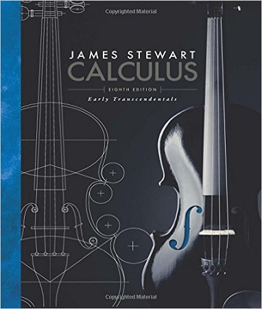
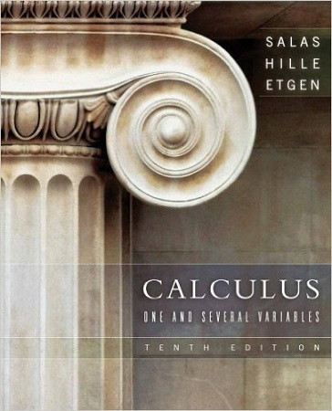

# 備考書籍推薦《理工篇》

##【微積分(Calculus)】
### 1. Calculus: Early Transcendentals

| **Calculus: Early Transcendentals** |
| -- |
| **Author**：James Stewart |
| **Publisher**：Brooks Cole; 8 edition (February 4, 2015) |
| **ISBN-10**：1285741552 |
| **ISBN-13**：978-1285741550 |

>**YuYumagic424**

>很多人推薦的書，講解算清楚，圖解也算畫得不錯，習題的選用也不錯，每章後面還會有 Problem Plus 提供進階一點的題目讓你思考，你想跳過不看也無妨。

>在向量分析的部份寫得算是不錯，如果你是選用別本微積分書，也可以借 James Stewart 這本來瞧瞧，但如果你是商管生農醫類的同學就不必了，因為通常你們不會學到向量分析…

>整體來說 James Stewart 這本算是各方面都蠻優秀的，或許每一方面都有其它書比他好（你可以找出有些書講解比它清楚、有些書的圖例比它好…等）但他就是整體來說都不錯。

### 2. Calculus: One and Several Variables

| **Calculus: One and Several Variables** |
| -- |
| **Author**：Einar Hille, Garret J. Etgen Satunino L. Salas |
| **Publisher**：Wiley, John & Sons, Incorporated (November 29, 2007) |
| **ISBN-10**：0471698040 |
| **ISBN-13**：978-0471698043 |

>**YuYumagic424**

> 在大多數的微積分課本當中，它是相對來說較注重理論證明的，也因此受到一些數學系的老師與同學喜愛，書中所用的色彩比較少，但我認為不至於因此讓插圖不好懂。

> 微積分的書在介紹自然指數時，有幾種不同的方法，有些是學極限時就先以極限 $$\displaystyle \lim_{n \to 0} (1+n)^{\frac{1}{n}}=e$$ 來定義自然指數 $$e$$ ，再介紹說 $$\ln{x}$$ 是以 $$e$$ 為底的對數。有些則是直接將 $$\ln{x}$$ 定義為函數 $$\displaystyle y=\frac{1}{z}$$ 曲線下變數自 $1$ 到 $x$ 的面積，然後用很理論的手法先討論說這函數具有某些性質（可能順便再用積分證明這些性質），討論出一堆性質後發現：『它就是一種對數！』然後說：「我們把這個對數的底叫做 $$e$$ 」，接著又繼續討論下去…

> 後者的手法，很多同學都會看不懂這到底在幹麻。我個人比較推薦用前者的手法來介紹自然指數，這不但比較好懂，而且就數學的演進史上來說是比較接近前者，發展史上根本不是用什麼 $$\displaystyle y=\frac{1}{z}$$ 曲線下面積這回事來發展自然對數的。數學有許多東西是這樣的，在歷史上是先有 A 接著發展出 B -> C -> D …等性質與定理，後來就有數學家說，我們由 C 當定義出發，可以推得 D 然後再推得 A 以及 B …等

> 而 Salas 這本書正是用這種方法在介紹自然指數的，其它有些書是兩種都有講（分為 Metric 和 Early  Transcental版本），或只用前者的。我個人是不知道用後者的手法呈現給非數學系同學看到底要幹嘛…每次都一堆同學搞不懂跑來問，讓我費力解釋它在幹嘛。唯有對於數學有興趣的同學，我才會推薦他讀讀後者這種說法。

> 他所寫向量分析的部份，以前的網路書評說它是敗筆。我是覺得向量分析在初微的課程當中，本來就算比較不好懂，那麼你遇到較理論一點的書時，那當然是更不好懂…

> 建議你如果是選用 Salas 這本書，你可以先讀讀別的書怎麼講解向量分析，再回來看 Salas。其實它沒有這麼不可取，向量分析的一些運算練習譬如說你要怎麼把距離 $$r$$ 取梯度？怎麼把 $$\displaystyle \frac{1}{r}$$ 取梯度，乃至於再進階一點的運算，來看這本書還是會有收穫的。但若是你唯一的書的話，就會辛苦點了，不建議直接啃。