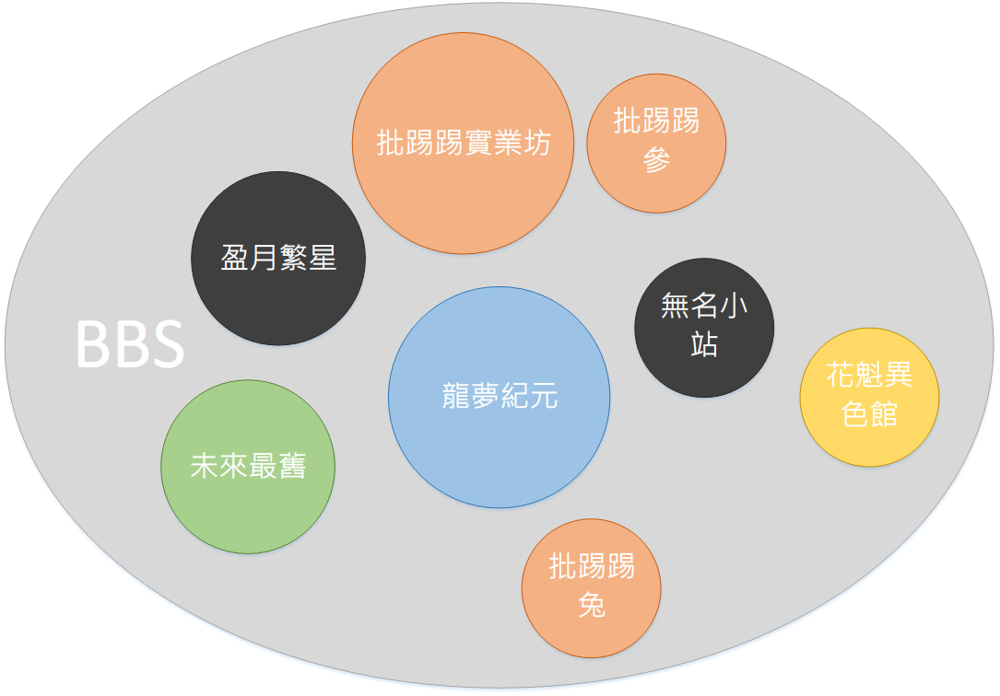

# 批踢踢實業坊介紹

## 一、什麼是 BBS？
電子佈告欄系統（BBS, Bulletin Board System）最初的設計與一般的佈告欄一樣，提供讀者查詢各項資訊；而與一般傳統的論壇不一樣的是，在電子佈告欄上面溝通是雙向的，**每個人都可以是讀者，也都可以是主筆**；加上現今網路是相當便宜容易取得，並且不受時間、空間的限制，在電子佈告欄上的作家可以分散各國，可以從小孩到老年人，每個人都可以發表以及回覆自己的看法，正因此，在 BBS 上的資訊，總是最新並且開放，不會有一言堂的情況發生。

為了可以找到自己有興趣的討論話題， BBS 按照不同主題分成不同的「看板」，若該主題仍然太過廣泛，則再按照細類分成許多不同看板後，再將這些看板集合起來放置與一個「群組」底下，以方便找尋。例如，關於偶像影星方面的資訊，皆放在「視聽劇場」裡，底下再按照區域型態分成台灣、中港、日本，在台灣偶像裡面，又再細分成男、女、團體群組，其下才是各個偶像的看板。

有趣的是， BBS 使用的是純文字的介面，**所有的功能，都只需要透過鍵盤，不需要將手從鍵盤上移開去動滑鼠，就可以完成所有的事情**。由於 web 介面的盛行，若干 BBS 提出各種不同的方式，將原來純文字的 BBS與 web 介面進行整合。不過仍有相當多的使用者覺得直接使用純文字模式更為快速便捷。

> 批踢踢 (Ptt) 即是一個電子佈告欄。按照不同的主題訴求。批踢踢並且提供的許多更甚於原來電子佈告欄系統更強大的功能，包括可以線上交談(分成水球、聊天、以及聊天室三種不同方式) 、電子郵件 (包括站內寄信以及一般 Internet  郵件)、小遊戲以及其他等等。批踢踢同時提供諸如 Web BBS ， Web 精華區以及其他的服務。

- 簡而言之，批踢踢實業坊屬於電子佈告欄的一種，其餘臺灣還盛行之電子佈告欄有：批踢踢實業坊、未來最舊小棧…等，如下圖所示：

## 二、批踢踢實業坊介紹
[批踢踢實業坊](https://www.ptt.cc/index.html) 於 1995 年 9 月 14 日成立，創站者為當時國立臺灣大學資訊工程學系二年級學生杜奕瑾。批踢踢兔成立於 2000 年，以提供個人板以及團體等私人性質為主的看板服務。批踢踢參在2004年4月創立於美國華府，主要提供海外學生專用，使用 MediaWiki 。除了主要的 BBS 服務，批踢踢也設計了 Blog、Wiki 的服務，供註冊用戶申請。其中 PTTwiki 服務於 2004 年 2 月 5 日啟用， PTTwiki 採用 Tavi 系統，直到 2006 年年初，是臺灣最主要提供個人 wiki 服務的網站。不同於其他成功的社群網站，批踢踢秉持自由與非商業化承諾。

2000 年，台大校方對 BBS 站椰林風情提出新的限制，為防止網路援交與一夜情，取消椰林風情查詢網友暱稱與名片檔功能。此舉引起椰林風情原有使用者不滿，大舉移動到其他 BBS 站，批踢踢快速成長。批踢踢在使用者人數漸增的情況下，逐漸成為台灣最大的網路討論空間。眾多不同種類的話題都能在批踢踢上激盪出討論的熱潮，甚至影響到真實的生活層面，於是批踢踢成為台灣新聞記者矚目與取材的焦點。除此，也曾因制度或言論等引起風波與爭議。

- [Wikipedia - 電子佈告欄系統(BBS)](https://zh.wikipedia.org/wiki/BBS)
- [Wikipedia - 批踢踢實業坊(PTT)](https://zh.wikipedia.org/wiki/%E6%89%B9%E8%B8%A2%E8%B8%A2)
- [PTT 與 BBS 教學](http://ptt-kkman-pcman.org/)
- [PTT 鄉民百科](http://zh.pttpedia.wikia.com/wiki/PTT%E9%84%89%E6%B0%91%E7%99%BE%E7%A7%91)