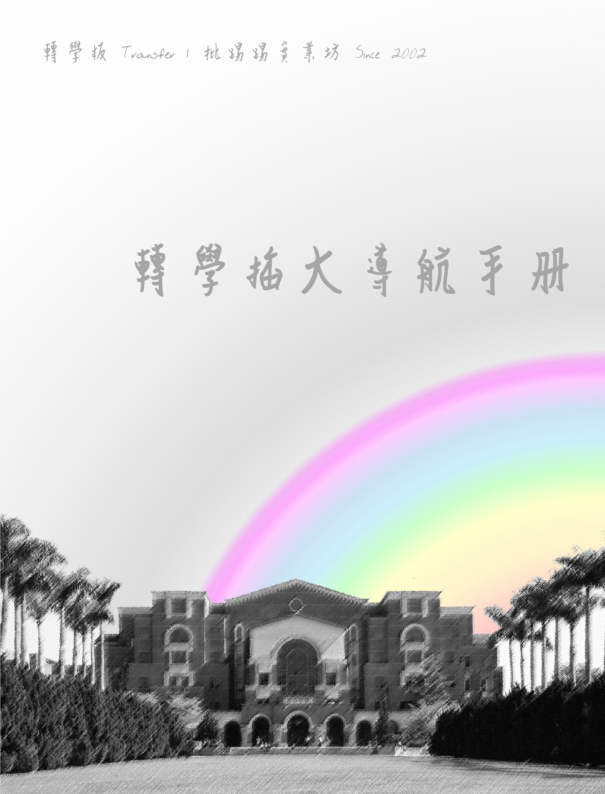

# 轉學插大導航手冊

會踏上轉學插大考試的每個考生，通常都有著自己的故事，或許是不甘於現在所學，或許是經歷過退學、二一的洗禮，又或許是畢業後在某個夜深人靜的夜晚幡然驚醒，察覺現今的生活現狀不是自己所期待的，而想再次投入大專院校教育體系中。

對於插大轉學考試，由於考生屬於小眾群體，加上歷年來考題與制度多變，致使考生在準備上有許多疑問，遂整理 [批踢踢實業坊 | 轉學板](https://www.ptt.cc/bbs/Transfer/index.html) 中由歷屆備考生所留下之資訊與答疑，旨在提供應考生對於轉學考試的認識。文中多數內容取自 [板友 Dionisio 之文章《轉學 Q&A ── 身為轉學生不得不看》](https://www.ptt.cc/bbs/Transfer/M.1267303251.A.B01.html) ，在此特別感謝之。

## 致那些感到茫然疲憊的考生們

> Life can seem cruel, no doubt about it. Sometimes the bad breaks
pile up and you just can’t see a way out. You may not like the sound
of that, but maybe you still aren’t convinced that it can happen for
you right now.
>
> The fact is that as mere mortals, you and I have limited vision.
We can’t possibly see what lies ahead. That’s both the bad news and
the good news. My encouragement to you is that what lies ahead
may be far better than anything you ever thought possible. But it’s
up to you to get over it, get up, and show up!
> 
> Whether your life is good and you want to make it better, or
whether it’s so bad you just want to stay in bed, the fact is that
what happens from this very moment is up to you and your Maker.
True, you can’t control everything. Too often bad stuff happens to
people no matter how good they are. It may not be fair that you
weren’t born into a life of ease, but if that is your reality, you have
to work with it.
>
> ── Nick Vujicic, “Life Without Limit”